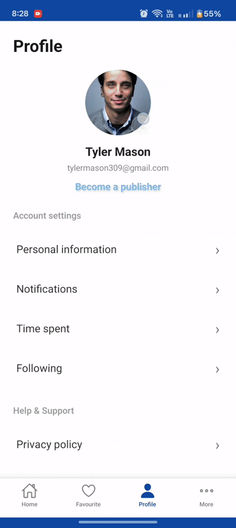

# 📱 React Native Assignment Project

A **React Native application** built using `@react-native-community/cli`, covering multiple assignments focused on UI, API integration, and native Android features.

---

## 📌 Overview

This project demonstrates:

- Clean UI implementation  
- API integration  
- Navigation patterns  
- Native Android module integration  
- Environment-based builds  

---


## 🧩 Assignments

### ✅ Assignment 4 – Native Integration (March 2026)

**Features:**
- Android Native Modules Integration  
- ExoPlayer Video Integration  
- Runtime Permissions Handling  
- Camera Integration  
- Gallery/File Picker  
- APK / AAB Generation  

 
---


### ✅ Assignment 2 & 3 – News App

**Features:**
- Bottom Tab Navigation  
- Screens: Home | Login | Profile  

**Dynamic News Categories:**
- Business  
- Sports  
- Technology  
- Health  

**Additional Features:**
- News API Integration (US & India)  
- News Detail Screen Navigation  

**Tech Highlights:**
- API Integration  
- Dynamic Rendering  
- Reusable Components  
- Responsive UI  

 
---

### ✅ Assignment 1 – UI Screens

**Features:**
- Home Screen  
- Detail Screen  
- View All Screen  
- Home Filters  
- Add to Favorites  

**Tech Highlights:**
- Styled Components  
- Responsive Layout  
- Navigation Setup  
- Clean UI Design  

---

## ⚙️ Tech Stack

- React Native  
- TypeScript  
- React Navigation  
- Functional Components  
- React Hooks  

---

## 🚀 Getting Started

### 📦 1. Install Dependencies

Make sure you have:

- Node.js  
- npm or yarn  
- Android Studio  
- Xcode (Mac only for iOS)  

```bash
npm install
```

---

### ▶️ Start Metro Server

```bash
npm start
# OR
yarn start
```

---

## 📱 Run the App

### 🤖 Android

```bash
npm run android
# OR
yarn android
```

---

### 🌍 Environment-based Builds

```bash
npm run android:dev
npm run android:staging
npm run android:prod
```

---

### 🍏 iOS (Mac Only)

Install CocoaPods dependencies:

```bash
bundle install
bundle exec pod install
```

Run the app:

```bash
npm run ios
# OR
yarn ios
```

---

## 📦 Build APK / AAB

### Generate APK

```bash
cd android
./gradlew assembleRelease
```

### Generate AAB

```bash
./gradlew bundleRelease
```

---

## 📂 Project Highlights

- Modular and scalable structure  
- Clean and maintainable code  
- Separation of concerns  
- Native + React Native hybrid implementation  

---

## 📸 Demo

Demo GIFs are available inside:

```
/assets/
```

---

## 📎 Reference

- https://reactnative.dev  
- https://github.com/react-native-community/cli  

---

## 👨‍💻 Author

**Naveen Sharma**